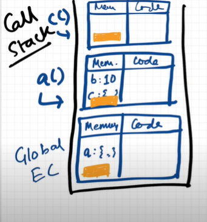
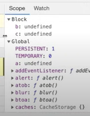
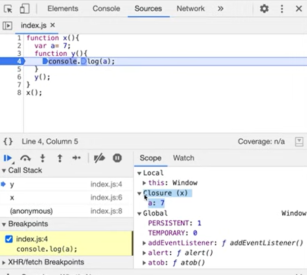
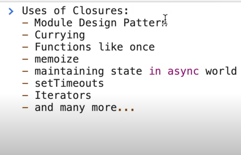

## what is JavaScript :

### JavaScript is a Synchronous single threaded language.

- that means js executed one command at a time.

- everything in javscript happens inside an "Execution Context".

- there are two components inside the Execution Context called Memory(Variable Environment) and code(thread of execution) componets.

   Memory | Code |
  | ------ |------|
  |key value pairs are stored |whole code is executed line by line.
  

## behind the scene of when js run : step by step
smaple code
```js
var n = 2;
function sq(){
   var ans = num*nnum;
   return ans;
}

var sq2 = sq(n);
var sq4 = sq(4);
```

### first phase (Memory creation) : 
memory alocated to the declared variable & functions.

 Memory | Code |
  | ------ |------|
  |n:undefined| |
  |sq:{ ... } | |
  |sq2:undefined| |
  |sq4:undefined| |

### second phase (Code Execution ) : 
- code is executed line by line and respective value is intialised to the memory.
the functions invocation also happens here.

- the mini *Execution Contex* is created for run the function invocation inside the Code.

- 

- Also The call stack is created to manage the context creation.
 when code start runs the stack initially have a *Global Execution Context* .    

## Windows & This Keyword : 

- *Window* is a global object which is created along with the global execution context. 
- when javascript run it always create a global object. for brouser the object called *window*.
- ***this*** is created along with every new context. so that, for global execution context ***this*** represents global context. and it is equl to window.  

## Scope and Scope chain :

- scope is basically means where you can access a specific variable or a function in code.

- *Lexical Environment* : lets take a example 

```js
function a(){
   var b =10;
   c();
   function c(){

   }
}

a();
console.log(b);

//Output : error- b is not defined
```
lexical means hirarchy,
when exicution context created the lexical environment also created which point to its parent.

from the above example the function ***c*** is lexically inside the function ***a*** .that means ***a*** is a parent of ***c*** .



 ## var, let and const :
 - when variable is declared there some memory is alocated for that variable called *Hoisting*.

- var is atach to the global object. when we declared var the "undefine" is initialized to var.
- let and const are not in global object we cannot access it without initialising.it hoisted in different memory space. 

### ***temporel Deadzone*** :
It is time since let variable was hoisted till it initialize some value.

## Block Scope and Shadowing : 

### What is Block ? 
- block is define by curly braces { } , it is also called as compound statement.
- block is used to combined multiple javascript statements into a group.
- the group of multiple statements can be ised in a place where javascript wants single statements. that means block is used to form single statments from group of code.

```js
//single statemet
if(true) console.log(10); 

 //block act as a single statements
if(true){     .
   var a = 10;
   console.log(a)
}

```
### what is block scope?
-it means what all variables and functions can access inside the block
- let and const are hoisted inside the block scope.we can access this variables outside the scope. see below example with image.
  ```js
  {
   var a = 10;
   let b = 20;
   const c =30;
  }
  ```
  

### what is Shadowing ?
- lets see an example
  ```js
  var a = 10;
  const b = 20;
  let c = 30; 

  {
   var a = 100;
   const b = 200;
   let c = 300;

   console.log(a)
   console.log(b)
   console.log(c)
  } 

   console.log(a)
   console.log(b)
   console.log(c)

   /* output :-
      inside block: 
           100
           200
           300
      outside block:
           100
           20
           30      

   ```
   the var inside the block shadowing the var outside the var cause it is hoisting inside the global scope.
   
   const and let create the block scope .the two memory are created for inside scope and outside scope variables (let & const).  

### illegal shadowing?
 ```js
  let a = 20;
  {
   var a = 20;
  }

  //output : syntaxerror
  ```

## Closures in JS 
- function along with its lexical scope forms the closure.
  ```js
  function x(){
   var a = 7;
   function y(){
      console.log(a);
   }
   y();
  }

  x();

  // output : 7

  ```
  first a search in y() if not there then it will search in parent of y() means inside the x().

  
- lets see another the example of closure 
  ```js
  function x(){
   var a = 7;
   function y(){
      console.log(a)
   }
   return y;
  }

  var z = x();
  console.log(z);
  //.....
  z();

  //output :
       function y()
       7
  ``` 
  

## setTimeout in JS 
### question on js ?
   ```js
   // example 1 
   function x(){
   for(var i = 1; i<=5; i++){

      function close(i){
         setTimeout(function() 
   {
            console.log(i);
         }, i*1000)
      }
      close(i);
   }
   console.log("javascript");
   }
   x();

   //example 2
   function x(){
   for(let i = 1; i<=5; i++){
      setTimeout(function(){
         console.log(i);
      }, i*1000)
   }
   console.log("javascript");
}
x();

// example 3
function x(){
   for(var i = 1; i<=5; i++){
      setTimeout(function(){
         console.log(i);
      }, i*1000)
   }
   console.log("javascript");
}
x();

```

## Functions in javascript

### 1. Function Statemet aka Function Declaration
 the way of creating function like below
   ```js
   function a(){
      console.log("Hellow")
   }

   a();
   ```
### 2. Function Expression
  ```js
  const b = function (){
   console.log("Hellow")
  }   

  b();
```

### 3. Anonymous Function
- A function without a name
```js
  function (){
   console.log("Hellow")
  }   

// it will gives error
```
### 4. Named Function Expression
```js
var b = function ayz() {
   console.log("B function")
}

b();
// xyz(); // will give error
```
### 5. First Class functions

the ability of function to pass as a value and return as a value.

we can pass the functions as a arguments and we can also return a function from.

```js

var b = function (param) {
   console.log("B function")
}

function a(){
 return function xyz(){ }

}

b(a());
```
### 6 . Arrow Functions
```js

```

## Higher order Functions : 

### 1 . Map()

```js
const arr = [2,3,4,5,8,6];

function double(x){
   return x*2;
}
const output= arr.map(double())

console.log(output)
// output: [4,6,8,10,16,12]
```
### 2 . filter()
```js
const arr = [2,3,4,5,6,7];

function isOdd(x){
   return x % 2; 
}
const output = arr.filter(isOdd);

console.log(output);

//output: 3,5,7
```

3 . reduce()
  
  use to return the single value from the array
```js

const arr = [2,3,4,5,8,6];

function findSum(arr){
   let sum = 0;
   for (let i = 0; i< arr.length; i++){
      sum = sum+arr[i];
   }
   return sum;
}

console.log(findSum(arr));

// using reduce function

const output = arr.reduce((acc,curr)=>{
   acc= acc+curr;
   return acc;
},0)   // 0 is a inetial value for acc

console.log(output);

// find max value in arr

const maxValue = arr.reduce((max,curr)=>{
   if(max < curr){
      max = curr;
   }
   return max
},0)

console.log(maxValue);

```
